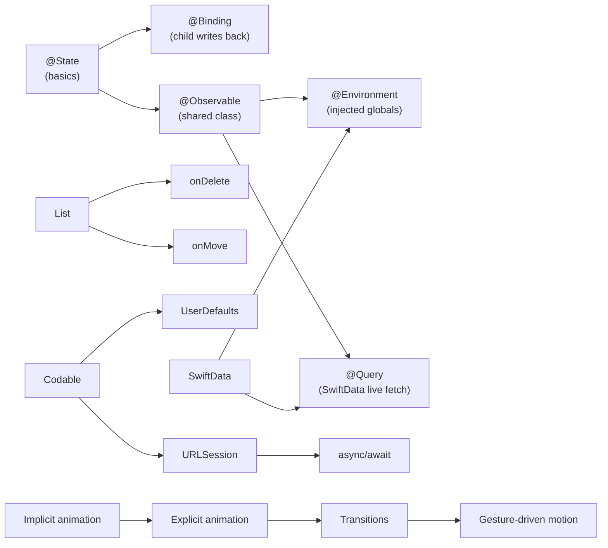

# Knowledge Graph

> How projects and concepts connect across the entire vault.

---

## Project → Concept Map

```mermaid
graph TD
    subgraph Projects
        WS[WordScramble]
        AT[AnimationTechnique]
        IE[iExpense]
        MS[Moonshot]
        CC[Cupcake Corner]
        BW[BookWorm]
    end

    subgraph State["State & Data Flow"]
        STATE[@State]
        BIND[@Binding]
        OBS[@Observable]
        ENV[@Environment]
        QUERY[@Query]
    end

    subgraph Nav[Navigation]
        NAVSTACK[NavigationStack]
        SHEET[Sheet]
        NAVDEST[navigationDestination]
    end

    subgraph Layout[Layouts & Lists]
        LIST[List + ForEach]
        GRID[LazyVGrid]
        SCROLL[ScrollView]
    end

    subgraph Persist[Persistence]
        UD[UserDefaults]
        SD[SwiftData]
    end

    subgraph Net[Networking]
        URL[URLSession]
        COD[Codable]
        ASYNC[async/await]
        AIMG[AsyncImage]
    end

    subgraph Anim[Animations]
        IMPL[Implicit]
        EXPL[Explicit]
        TRANS[Transitions]
        DRAG[DragGesture]
    end

    WS --> STATE
    WS --> LIST
    WS --> NAVSTACK

    AT --> IMPL
    AT --> EXPL
    AT --> TRANS
    AT --> DRAG

    IE --> OBS
    IE --> STATE
    IE --> SHEET
    IE --> UD
    IE --> COD

    MS --> NAVDEST
    MS --> NAVSTACK
    MS --> GRID
    MS --> SCROLL
    MS --> COD

    CC --> OBS
    CC --> URL
    CC --> COD
    CC --> ASYNC
    CC --> AIMG
    CC --> NAVDEST

    BW --> SD
    BW --> QUERY
    BW --> ENV
    BW --> BIND
    BW --> LIST
```

---

## Concept Dependency Graph

How concepts build on each other:



---

## Concept Coverage by Project

|  | WS | AT | iExpense | Moonshot | Cupcake | BookWorm |
|---|:---:|:---:|:---:|:---:|:---:|:---:|
| @State | ✓ | ✓ | ✓ | ✓ | ✓ | ✓ |
| @Binding | | | | | | ✓ |
| @Observable | | | ✓ | | ✓ | |
| @Environment | | | | | | ✓ |
| @Query | | | | | | ✓ |
| NavigationStack | ✓ | | ✓ | ✓ | ✓ | ✓ |
| Sheet | | | ✓ | | | |
| List | ✓ | | ✓ | | | ✓ |
| LazyVGrid | | | | ✓ | | |
| Implicit animation | | ✓ | | | | |
| Explicit animation | | ✓ | | | | |
| Transitions | | ✓ | | | | |
| UserDefaults | | | ✓ | | | |
| SwiftData | | | | | | ✓ |
| URLSession | | | | | ✓ | |
| Codable | | | ✓ | ✓ | ✓ | |
| async/await | | | | | ✓ | |
| AsyncImage | | | | | ✓ | |
